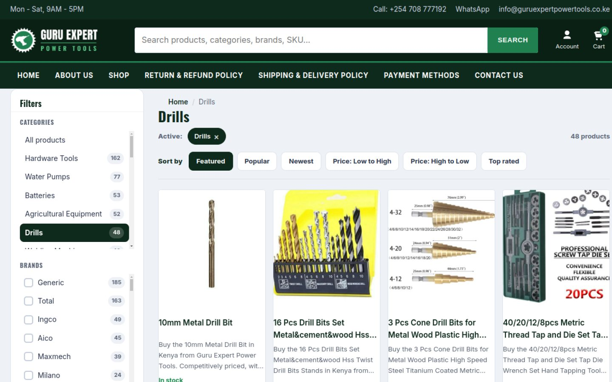
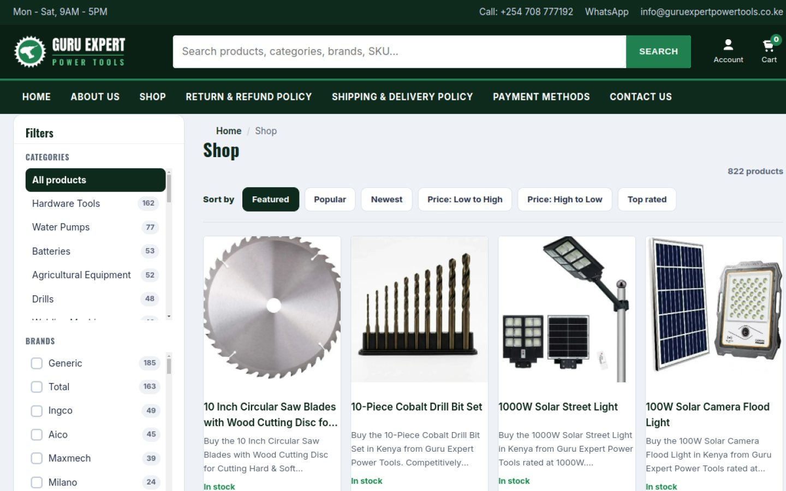
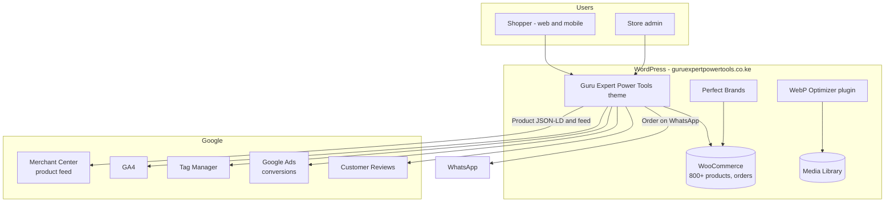
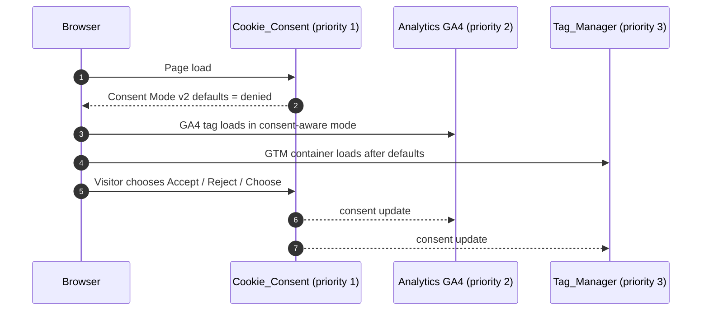
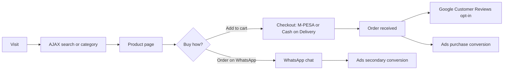
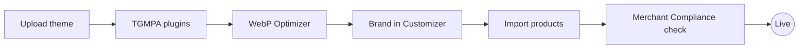

<div align="center">


# Guru Expert Power Tools

**Custom WordPress + WooCommerce platform for [guruexpertpowertools.co.ke](https://guruexpertpowertools.co.ke/)**: power tools, solar equipment, generators, pumps and hardware for Kenyan homes, workshops and sites.


[**Live site**](https://guruexpertpowertools.co.ke/) · [Shop](https://guruexpertpowertools.co.ke/shop/) · [Architecture](#architecture) · [Installation](#installation) · [Store policies](#store-policies-reflected-in-the-code) · [Roadmap](#roadmap)

</div>

---


## Table of contents
1. [Overview](#overview)
2. [Screenshots](#screenshots)
3. [Product range](#product-range)
4. [Features](#features)
5. [Architecture](#architecture)
6. [Project structure](#project-structure)
7. [Installation](#installation)
8. [Configuration](#configuration)
9. [Store policies reflected in the code](#store-policies-reflected-in-the-code)
10. [Tracking and analytics](#tracking-and-analytics)
11. [Roadmap](#roadmap)
12. [Conventions](#conventions)
13. [Business](#business)

## Overview

This repository holds the two custom parts of the live store. WordPress core, WooCommerce and third-party plugins are installed normally and are not tracked here.

| Package | Folder | Version | Role |
| --- | --- | --- | --- |
| **Guru Expert Power Tools** (theme) | [`guruexpert/`](guruexpert) | 1.24.2 | Storefront, WooCommerce integration, schema, security, consent, analytics and Merchant Center tooling |
| **WebP Optimizer** (plugin) | [`guruexpert-webp/`](guruexpert-webp) | 1.1.0 | One-click WebP conversion and delivery for the whole Media Library |

**Brand colours:** green `#208050` · deep green `#0E2A1C`

## Screenshots

| Category page with filters | Shop |
| --- | --- |
|  |  |

<p align="center">
  <br>
  <sub>Mobile homepage with sticky header, search and the Kenya Data Protection Act cookie banner</sub>
</p>

## Product range

<table>
  <tr>
    <td align="center"><br><sub>Drills</sub></td>
    <td align="center"><br><sub>Grinders</sub></td>
    <td align="center"><br><sub>Saws</sub></td>
    <td align="center"><br><sub>Welding Machines</sub></td>
    <td align="center"><br><sub>Toolsets</sub></td>
    <td align="center"><br><sub>Air Compressors</sub></td>
  </tr>
  <tr>
    <td align="center"><br><sub>Generators</sub></td>
    <td align="center"><br><sub>Water Pumps</sub></td>
    <td align="center"><br><sub>Solar Panels</sub></td>
    <td align="center"><br><sub>Solar Street Lights</sub></td>
    <td align="center"><br><sub>Batteries</sub></td>
    <td align="center"><br><sub>Car Wash Equipment</sub></td>
  </tr>
</table>

<table>
  <tr>
    <td></td>
    <td></td>
    <td></td>
  </tr>
  <tr>
    <td align="center"><sub>Power tools</sub></td>
    <td align="center"><sub>Solar and backup power</sub></td>
    <td align="center"><sub>Generators</sub></td>
  </tr>
</table>

## Features

### Storefront
- **Header:** contact bar (phone, WhatsApp, email, hours), sticky-on-scroll behaviour and a debounced **AJAX search** across products, categories, brands and SKUs
- **Homepage:** hero slider with touch, keyboard and autoplay support, *Popular* category chips, a trust band, *Shop by category* cards with live product counts, a brand strip and one product row per category
- **Uniform product cards:** 1:1 lazy-loaded images, clamped titles and descriptions, sale, stock and featured badges, star ratings, **AJAX add-to-cart** and **Order on WhatsApp**
- **Shop and category pages:** sidebar filters for category, brand and price with counts, plus sort pills (Featured, Popular, Newest, Price, Top rated)
- **Single product page:** delivery estimate, payment icons, *Specifications* and *FAQ* tabs, a sticky add-to-cart bar and *Recently viewed*
- **Policy pages:** Privacy, Terms, Shipping & Delivery, Returns & Refunds, Warranty, Payment Methods, Cookie Policy, FAQ and Track Order, written for Kenya

### Engineering modules (`GuruExpertPowerTools\` namespace)
| Module | Responsibility |
| --- | --- |
| `Setup` | Theme supports, menus, image sizes |
| `Assets` | Inlined critical CSS, deferred JS, deferred fonts, and WooCommerce asset trimming on non-shop pages |
| `Security` | Hardening headers, version-disclosure removal, `DISALLOW_FILE_EDIT`, XML-RPC off |
| `Login_Security` | Brute-force lockout, bot honeypot, generic error messages, reset throttling and strong customer passwords |
| `WooCommerce_Support` | Shop layout, product cards, cart fragments, filters |
| `Ajax` | Nonce-checked, capability-checked add-to-cart and live search endpoints |
| `Customizer` | Brand colours and contact details |
| `Schema` | JSON-LD for Organization, Store and LocalBusiness, plus Product (SKU, MPN, GTIN, brand, price, availability, condition, shipping, return policy) |
| `Cookie_Consent` | Consent banner with **Google Consent Mode v2** defaults, written for Kenya's Data Protection Act 2019 |
| `Single_Product` | Product page enhancements |
| `Merchant_Inspector` | Admin audit (*WooCommerce > Merchant Compliance*) of the store against Google Merchant Center policies, with a severity and fix for each finding |
| `Google_Customer_Reviews` | Opt-in survey on the order-received page, plus an optional seller-rating badge |
| `Whatsapp_Tracking` | Reports WhatsApp order clicks to Google Ads as a secondary conversion |
| `Analytics` | GA4 tag, placed after the consent defaults |
| `Tag_Manager` | GTM container, placed after the consent defaults and GA4 |
| `Landing_Funnels` | Category sales funnels at `/lp-{funnel}/`, with admin control under *WooCommerce > Sales Funnels* |

### Sales funnels (`/lp-{funnel}/`)
Landing pages for ad and social traffic. Each one is served with a 200 status, so you don't need a WordPress page, a rewrite rule or a permalink flush. Prices, stock and images always come live from WooCommerce.

| URL | Range |
| --- | --- |
| `/lp-generators/` | Generators |
| `/lp-water-pumps/` | Water pumps, including booster pumps |
| `/lp-pressure-washers/` | Pressure washers and car wash equipment |
| `/lp-vacuum-cleaners/` | Wet and dry vacuums and carpet cleaners |
| `/lp-air-compressors/` | Air compressors |
| `/lp-welding-machines/` | Welders and welder-generators |
| `/lp-demolition-breakers/` | Demolition breakers |
| `/lp-grinders/` | Angle grinders |
| `/lp-hardware-tools/` | Hardware tools and toolsets |
| `/lp-farm-machinery/` | Agricultural equipment |
| `/lp-engines/` | Petrol and diesel engines |
| `/lp-solar-panels/` | Solar panels |
| `/lp-solar-inverters/` | Solar inverters |
| `/lp-batteries/` | Batteries |
| `/lp-weighing-scales/` | Weighing scales |

Short alias URLs also work and canonicalise to the main URL. Examples are `/lp-compressors/`, `/lp-welders/`, `/lp-pumps/` and `/lp-agricultural-equipment/`. Any other `/lp-{category-slug}/` falls back to a generic funnel for that product category.

**Page flow, top to bottom:**
1. Hero with a live "From KSh" price and the number of models in stock
2. Trust strip covering delivery, payment, warranty and returns
3. Popular picks
4. Benefits
5. The full range, with price-band filter chips
6. Buying guide
7. How ordering works
8. WhatsApp quick-order form
9. FAQs
10. Shop address and hours
11. Related ranges
12. Sticky Call / WhatsApp / Shop bar on mobile

**Ordering and tracking:**
- Add to cart uses the theme's AJAX cart drawer.
- The WhatsApp form opens a pre-filled order through a real link click, so `Whatsapp_Tracking` records it as the secondary "WhatsApp Order Click" conversion. No new tags are added.

**Editing without code (*WooCommerce > Sales Funnels*):**
- Pin the "Popular picks" product IDs for each funnel, in order.
- Override the headline and subheadline.
- Switch a funnel off.

**Rules built into the funnels:**
- Products without a featured image are hidden from funnels until a photo is added. Filter: `guruexpertpowertools_funnel_require_image`.
- Policy wording (delivery, payment, warranty, defective-only returns) comes from `Landing_Funnels::store()`. It must stay identical to the product pages and policy pages.
- Funnel copy avoids "genuine/original/best" claims, fake counters and urgency. This is required for Merchant Center.
- Copy is edited in `Landing_Funnels::registry()`, or extended with the `guruexpertpowertools_funnels` filter.

**SEO:** each funnel gets its own title, meta description and canonical, handed to Rank Math when it is active. It also outputs BreadcrumbList, ItemList and FAQPage JSON-LD.

### WebP Optimizer plugin
- Converts every JPEG and PNG in the Media Library to WebP and keeps the originals
- Converts new uploads automatically, including every thumbnail size
- Serves WebP through auto-managed `.htaccess` rules. URLs stay `.jpg` or `.png`; the bytes delivered are WebP
- Deactivating it removes the rules. Images are never deleted

## Architecture

### System context



### Module boot sequence

`functions.php` loads an autoloader, then `inc/bootstrap.php` starts each module inside its own `try/catch`. If one module fails, it is logged and the rest of the site keeps running.

```mermaid
flowchart LR
    F[functions.php] --> AL[PSR-4 style autoloader] --> B[inc/bootstrap.php]
    B --> M1[Setup] --> M2[Assets] --> M3[Security] --> M4[Login_Security]
    M4 --> M5[WooCommerce_Support] --> M6[Ajax] --> M7[Customizer] --> M8[Schema]
    M8 --> M9[Cookie_Consent] --> M10[Single_Product] --> M11[Merchant_Inspector]
    M11 --> M12[Google_Customer_Reviews] --> M13[Whatsapp_Tracking] --> M14[Analytics] --> M15[Tag_Manager]
    B --> TG[TGMPA required plugins]
```



### Consent-first tag order in `wp_head`



### Order journey



## Project structure

```text
.
├── README.md
├── docs/
│   ├── screenshots/                   # Live-site screenshots used in this README
│   └── images/                        # Logo, category and slide thumbnails
├── guruexpert/                        # WooCommerce theme
│   ├── functions.php                  # Constants and autoloader
│   ├── inc/
│   │   ├── bootstrap.php              # Starts modules (guarded)
│   │   ├── class-*.php                # One class per module (see table above)
│   │   ├── helpers.php
│   │   ├── required-plugins.php       # TGMPA configuration
│   │   └── tgmpa/                     # TGM Plugin Activation library
│   ├── template-parts/                # hero, trust-band, featured-categories, product-section,
│   │                                  # promo-split, brand-strip, cta-band
│   ├── woocommerce/content-product.php# Uniform product card override
│   ├── assets/{css,js,img}/           # theme.css (+ min), industrial skin, home.css, ajax-cart.js, theme.js
│   ├── demo/content.xml               # Demo content
│   ├── README.md  SETUP-FLOW.md  IMPORT-PRODUCTS.md  ROADMAP.md
│   └── PERFORMANCE-htaccess-rules.txt # Optional caching and compression rules
└── guruexpert-webp/                   # WebP Optimizer plugin
    ├── guruexpertpowertools-webp.php
    └── readme.txt
```

## Installation

**Requirements:** WordPress 6.5 or later · WooCommerce 9 or later · PHP 8.1 or later (tested to 8.3) · HTTPS (required for checkout and Merchant Center)

1. Zip `guruexpert/` and upload it under **Appearance > Themes > Add New > Upload Theme**, then activate it.
2. Install the plugins TGMPA prompts for. At minimum that is **WooCommerce** and **Perfect Brands for WooCommerce**.
3. Zip and install `guruexpert-webp/`, activate it, then run **Media > WebP Optimizer > Optimize all images now**.
4. Upload the logo under **Customize > Site Identity**, then set colours and contact details under **Customize > Guru Expert Power Tools**.
5. Import products. See [`IMPORT-PRODUCTS.md`](guruexpert/IMPORT-PRODUCTS.md).
6. Optional: apply [`PERFORMANCE-htaccess-rules.txt`](guruexpert/PERFORMANCE-htaccess-rules.txt).



> **Deployment:** commits to this repository do **not** deploy automatically. Upload the changed theme or plugin folder to hosting for updates to go live.

Full walkthrough: [`guruexpert/SETUP-FLOW.md`](guruexpert/SETUP-FLOW.md)

## Configuration

| Where | Setting |
| --- | --- |
| Customize > Guru Expert Power Tools | Brand colours, phone, WhatsApp, email, hours, address |
| WooCommerce > Merchant Compliance | Runs the Merchant Center policy audit |
| Media > WebP Optimizer | Bulk conversion and status |
| `wp-config.php` | `GXPT_TRUSTED_PROXY_HEADER`, only if the site sits behind Cloudflare or another proxy, so login lockouts use the real visitor IP |

## Store policies reflected in the code

These values appear in templates, page copy and structured data. **Update them everywhere if the business policy changes:**

| Policy | Value |
| --- | --- |
| Delivery time | 1 to 5 business days, countrywide |
| Delivery fee | Flat KSh 500 countrywide. Bulky items are quoted separately |
| Payment | M-PESA and Cash on Delivery. Cash on Delivery is available in Nairobi only; orders outside Nairobi are paid before dispatch |
| Returns | 7 days |
| Warranty | Manufacturer warranty, not a store-issued warranty |

## Tracking and analytics

| Signal | Source | Note |
| --- | --- | --- |
| GA4 | `Analytics` module | Stands down if Site Kit connects Analytics |
| Google Tag Manager | `Tag_Manager` module | Loads after consent defaults |
| WhatsApp order click | `Whatsapp_Tracking` | Secondary Ads conversion, so it does not steer bidding |
| Purchase conversion | Theme / WooCommerce | Primary Ads conversion |

> **Important:** GA4, the WhatsApp click conversion and the purchase conversion are already fired by the theme. **Do not** recreate them as tags inside GTM. That double-counts every hit and corrupts Performance Max bidding.

## Roadmap

| Status | Item |
| --- | --- |
| Done | Architecture, design system, header, footer, homepage, product cards, AJAX cart and search, security, schema, consent, analytics, Merchant Inspector, single-product enhancements, shop filters |
| Planned | Quick View modal · wishlist and compare styling · one-click demo importer (`class-content-installer.php` and `class-demo-import.php` are placeholders) · critical CSS per template · QA and WCAG 2.2 AA audit |

Details: [`guruexpert/ROADMAP.md`](guruexpert/ROADMAP.md)

## Conventions

- Work is committed **directly to `main`**. Feature branches and pull requests are used only when requested.
- Keep the live site and this repo in sync. Commits do not auto-deploy, and a theme upload will overwrite any edit made only in wp-admin.
- Put site-specific custom code in a child theme so theme updates do not overwrite it.

## Business

**Guru Expert Power Tools**
Magomano House, 1st Floor, Room 10D, Tom Mboya Street, Nairobi, Kenya
Phone and WhatsApp: [+254 708 777192](tel:+254708777192) · Email: [info@guruexpertpowertools.co.ke](mailto:info@guruexpertpowertools.co.ke)
Hours: Mon - Sat, 9:00 AM - 5:00 PM

## Credits

Designed, developed and maintained by **[Pimofy Digital](https://github.com/moselanto)**, Nairobi.

## License

GNU General Public License v2 or later. See the [license text](https://www.gnu.org/licenses/gpl-2.0.html).
